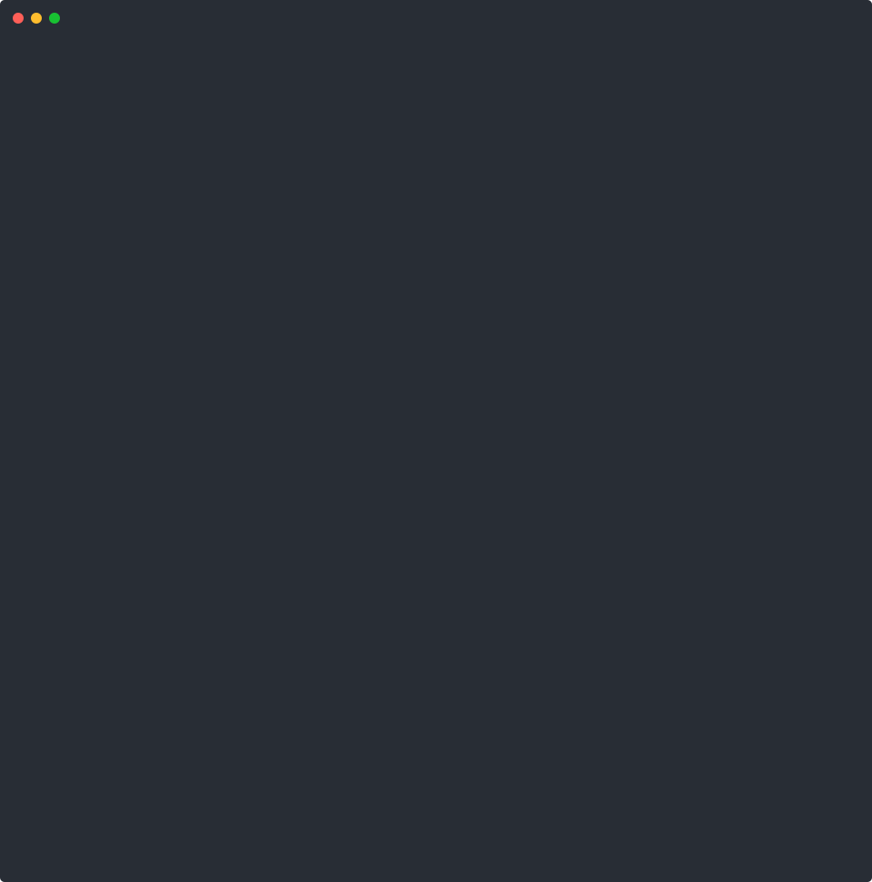

# Puck

[](LICENSE)
[](https://github.com/puck-security/puck-scout/releases/latest)
[](https://github.com/puck-security/puck-scout/actions/workflows/go.yml)

**Autonomous, read-only endpoint investigation via MCP.**  Ask a question about your fleet in plain English; get a narrative answer with containment recommendations.

[Getting Started](docs/getting-started.md) · [Reference](docs/reference.md) · [Architecture](docs/architecture.md) · [Security](docs/security.md) · [**Enterprise / Hosted ↗**](https://puck.security/enterprise)

<p align="center">
  
</p>

## How It Works

```
                          You type a question
                                 |
                                 v
┌──────────────────────────────────────────────────────┐
│  MCP Client (Claude Code / Cursor / any MCP client)  │
│  Calls puck_investigate, reasons about results,       │
│  decides what to check next                           │
└──────────────────┬───────────────────────────────────┘
                   │ stdio (JSON-RPC)
                   v
┌──────────────────────────────────────────────────────┐
│  MCP Server (Go)                                      │
│  Loads skills, validates commands against policy       │
│  engine, fans out to agents, writes audit log before   │
│  every command, enforces cost caps                     │
└─────────┬──────────────┬──────────────┬──────────────┘
          │ mTLS poll     │              │
          v              v              v
     ┌─────────┐   ┌─────────┐   ┌─────────┐
     │ Agent   │   │ Agent   │   │ Agent   │   Rust binaries.
     │ host-01 │   │ host-02 │   │ host-03 │   Read-only. Does not
     └─────────┘   └─────────┘   └─────────┘   write to disk.
```

**Investigation flow**: pathfinder → checkpoint → fleet → iterate → analyze → save (persisted to `investigations/`). See [Architecture](docs/architecture.md) for what each stage does.

## MCP Tools

| Tool | What it does |
|------|--------------|
| `puck_investigate` | Start an investigation; returns connected agents and the initial skill context. |
| `puck_list_skills` | List loaded skills — call before `puck_investigate` to discover what's available. |
| `puck_get_skill_section` | Fetch additional sections (`fleet_strategy`, `remediation_guidance`, `readme`, `full`) of the bound skill on demand. |
| `puck_run_check` | Run a single read-only command on one endpoint. |
| `puck_query_fleet` | Fan out a command across multiple endpoints in parallel. |
| `puck_save_analysis` | Save the final report as markdown. |
| `puck_continue` | Extend the command budget when an investigation needs more turns. |

Full schemas in [reference.md](docs/reference.md).

## Components

- **Endpoint Agent** (Rust, `agent/`) — read-only command executor on the endpoint. Native binaries for Linux, macOS, and Windows (amd64 + arm64).
- **MCP Server** (Go, `mcp/`) — orchestrates investigations: loads skills, validates commands, fans out to agents, writes the audit log.
- **Skills Library** (YAML, `skills/`) — investigation playbooks. Contribute a new one without writing Rust or Go.

## Quick Start

Install the server, enroll an endpoint, investigate. Download binaries from [GitHub Releases](https://github.com/puck-security/puck-scout/releases/latest).

**1. Set up the MCP server** (your workstation or an ops box)

```bash
# Install puck-mcp onto PATH, then:
bash <(curl -fsSL https://raw.githubusercontent.com/puck-security/puck-scout/main/scripts/setup-mcp.sh) \
  --hostname $(hostname)
```

This generates a CA, server cert, and config. If the `claude` CLI is installed, it auto-registers Puck as an MCP server — no manual config needed. Otherwise it prints the command to register manually.

> **Roaming MCP host** (laptop, dynamic IP)? Pass a stable `--hostname` (Tailscale / DDNS / static) so agents don't lose the server — see [Getting Started](docs/getting-started.md). If the address changes after enrollment, `puck-mcp rotate-server-cert --add-san <name-or-ip>` fixes it without re-enrolling.

**2. Enroll an endpoint**

```bash
# On the server: generate a one-time bootstrap token
puck-mcp generate-bootstrap-token --hostname eng-laptop-47

# On the endpoint: install + enroll (token-safe pattern; full details in docs/getting-started.md):
TF=$(mktemp /tmp/puck-bt.XXXXXX) && chmod 600 "$TF"
printf 'Paste puck-bt-… (hidden): '; read -rs T; echo; printf '%s' "$T" > "$TF"; unset T
bash <(curl -fsSL https://raw.githubusercontent.com/puck-security/puck-scout/main/scripts/install-agent.sh) \
  --server https://your-server:50281 \
  --hostname eng-laptop-47 \
  --token-file "$TF" \
  --download-binary
shred -u "$TF" 2>/dev/null || rm -f "$TF"
```

**3. Investigate**

Open Claude Code and ask:

```
Use puck to check eng-laptop-47 for credential exposure
```

Repeat step 2 for every endpoint you want to investigate. For fleet enrollment (10+ hosts), see [Getting Started](docs/getting-started.md#multiple-hosts-fleet-enrollment).

> **Local dev?** To try Puck on your own machine without deploying anything: `cd test && make test-install && make run-agent`, then ask Claude Code a question. See [Getting Started](docs/getting-started.md).

For tool schemas, config fields, and CLI docs, see [Reference](docs/reference.md).

## Privacy

Puck sends endpoint findings (process lists, file paths, network connections, credential exposure results) to Claude for analysis. **Do not run Puck under a Free, Pro, or Max Claude.ai account without first disabling model training** — those plans use conversation data to train models by default, with 5-year retention.

| Auth method | Training by default | Safe for sensitive data |
|---|---|---|
| Anthropic API key (`ANTHROPIC_API_KEY`) | No — commercial terms always apply | Yes |
| Claude Code OAuth — Teams or Enterprise plan | No — commercial terms apply | Yes |
| Claude Code OAuth — Free, Pro, or Max plan | **Yes, unless opted out** | Only after opting out |

If you are on a Free, Pro, or Max plan and cannot switch, opt out at [claude.ai/settings/data-privacy-controls](https://claude.ai/settings/data-privacy-controls) before running any investigation. The API or a Teams/Enterprise plan is strongly preferred for production use.

See [Anthropic's data usage documentation](https://code.claude.com/docs/en/data-usage) for the authoritative policy.

## Safety Model

One shared typed allowlist (`policy/policy.toml`, embedded into both binaries) is enforced independently by the server (before dispatch) and the agent (before execution). Anything outside the compiled-in grammar is rejected — a compromised server cannot instruct the agent to run anything new. Operators can enable/disable existing entries via `/etc/puck/policy-overrides.toml`; adding new binaries requires a PR. **The worst case of a Puck compromise is unauthorized read access, not unauthorized modification.**

**EDR and endpoint security tools may flag puck-agent.** The agent reads sensitive files (process memory maps, keychains, credential files, network connections), so the same signals that make it useful for IR can trip heuristics in security products. If you're deploying alongside an EDR, allowlist the `puck-agent` binary before enrolling endpoints — a false positive from your own IR tooling mid-investigation is a bad time.

See [docs/security.md](docs/security.md) for the full threat model.

## Project Layout

```
puck-scout/
  agent/          Rust endpoint agent
  mcp/            Go MCP server
  skills/         Investigation playbooks (YAML)
  demo/           Demo scripts for local testing
  docs/           Architecture, security model, ADRs, getting started
  integrations/   Third-party integrations (TheHive, Tines)
```

## Enterprise / Hosted

Puck Scout is the open-source investigation core under the MIT license — free to use, modify, and self-host.  For teams that want more than self-hosted:

| | OSS (this repo) | Puck Security (hosted) |
|---|---|---|
| MCP server | Self-hosted | Managed multi-tenant brain |
| SSO + RBAC | DIY | Built-in (Okta, Azure AD, Google) |
| Multi-tenant fleet-of-fleets | One fleet per server | Yes, with per-tenant audit isolation |
| Compliance attestations | None | SOC 2 Type II + HIPAA-aligned |
| Team-built skills | YAML, contribute via PR | Custom skills built + maintained by Puck team |
| Investigation runbooks | Self-write | Tabletop-tested, IR-engineer-reviewed |
| Support | GitHub issues | 24×7 with SLA |

Go to **[puck.security/enterprise](https://puck.security/enterprise)**

## Documentation

- [Getting Started](docs/getting-started.md) — install + first investigation
- [Tutorial](docs/tutorial.md) — full Trivy-breach walkthrough
- [Reference](docs/reference.md) — tool schemas, config fields, skill YAML, CLI
- [Architecture](docs/architecture.md) — system design and data flow
- [Security Model](docs/security.md) — threat model + deployment recommendations
- [Operations Guide](docs/operations.md) — PKI recovery, CA rotation, policy migration
- [Contributing](docs/contributing.md) — skills, bug fixes, features

## Contributing

The easiest way to contribute is a new investigation skill. Skills are YAML -- no Rust or Go required. See [docs/contributing.md](docs/contributing.md).

## License

MIT.  See [LICENSE](LICENSE).

Contributors sign a CLA on first PR — see [CLA.md](CLA.md).

Copyright (c) 2026 Puck Security, Inc.
